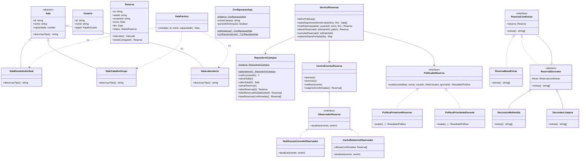

# Diagrama de Classes

```mermaid
classDiagram
    %% ── DOMÍNIO ──────────────────────────────────────────────────────────────

    class Sala {
        <<abstract>>
        +id: string
        +nome: string
        +capacidade: number
        +descricaoTipo() string
    }

    class SalaEstudoIndividual {
        +descricaoTipo() string
    }

    class SalaTrabalhoGrupo {
        +descricaoTipo() string
    }

    class SalaLaboratorio {
        +descricaoTipo() string
    }

    Sala <|-- SalaEstudoIndividual
    Sala <|-- SalaTrabalhoGrupo
    Sala <|-- SalaLaboratorio

    class Usuario {
        +id: string
        +nome: string
        +papel: PapelUsuario
    }

    class Reserva {
        +id: string
        +salaId: string
        +usuarioId: string
        +inicio: Date
        +fim: Date
        +status: StatusReserva
        +intervalo() Intervalo
        +cloneCom(patch) Reserva
    }

    %% ── FACTORY METHOD ───────────────────────────────────────────────────────

    class SalaFactory {
        +criar(tipo, id, nome, capacidade) Sala
    }

    SalaFactory ..> SalaEstudoIndividual : <<cria>>
    SalaFactory ..> SalaTrabalhoGrupo   : <<cria>>
    SalaFactory ..> SalaLaboratorio     : <<cria>>

    %% ── SINGLETON ────────────────────────────────────────────────────────────

    class RepositorioCampus {
        -instance: RepositorioCampus$
        +getInstance()$ RepositorioCampus
        +runExclusive(fn) T
        +salvarSala(s)
        +obterSala(id) Sala
        +salvarReserva(r)
        +obterReserva(id) Reserva
        +listarReservasNaSala(salaId) Reserva[]
        +listarReservasConfirmadas() Reserva[]
    }

    class ConfiguracaoApp {
        -instance: ConfiguracaoApp$
        +nomeCampus: string
        +persistirEmArquivo: boolean
        +getInstance()$ ConfiguracaoApp
        +configurar(opcoes)$ ConfiguracaoApp
    }

    %% ── OBSERVER ─────────────────────────────────────────────────────────────

    class ObservadorReserva {
        <<interface>>
        +atualizar(evento, centro)
    }

    class CentroEventosReserva {
        +anexar(o)
        +remover(o)
        +notificar(evento)
        +snapshotConfirmadas() Reserva[]
    }

    class NotificacaoConsoleObservador {
        +atualizar(evento, centro)
    }

    class CacheRelatorioObservador {
        +ultimasConfirmadas: Reserva[]
        +atualizar(evento, centro)
    }

    ObservadorReserva <|.. NotificacaoConsoleObservador
    ObservadorReserva <|.. CacheRelatorioObservador
    CentroEventosReserva o-- ObservadorReserva

    %% ── STRATEGY ─────────────────────────────────────────────────────────────

    class PoliticaDeReserva {
        <<interface>>
        +avaliar(candidata, outras, usuario, obterUsuario, ignorarId) ResultadoPolitica
    }

    class PoliticaPrimeiroAReservar {
        +avaliar(...) ResultadoPolitica
    }

    class PoliticaPrioridadeDocente {
        +avaliar(...) ResultadoPolitica
    }

    PoliticaDeReserva <|.. PoliticaPrimeiroAReservar
    PoliticaDeReserva <|.. PoliticaPrioridadeDocente

    %% ── DECORATOR (BÔNUS) ────────────────────────────────────────────────────

    class ReservaComExtras {
        <<interface>>
        +reserva: Reserva
        +extras() string[]
    }

    class ReservaBaseExtras {
        +extras() string[]
    }

    class ReservaDecorator {
        <<abstract>>
        #inner: ReservaComExtras
        +extras() string[]
    }

    class DecoratorMultimidia {
        +extras() string[]
    }

    class DecoratorLimpeza {
        +extras() string[]
    }

    ReservaComExtras <|.. ReservaBaseExtras
    ReservaComExtras <|.. ReservaDecorator
    ReservaDecorator <|-- DecoratorMultimidia
    ReservaDecorator <|-- DecoratorLimpeza
    ReservaDecorator o-- ReservaComExtras

    %% ── SERVIÇO ──────────────────────────────────────────────────────────────

    class ServicoReservas {
        +definirPolitica(p)
        +salasDisponiveisNoIntervalo(inicio, fim) Sala[]
        +criarReserva(salaId, usuarioId, inicio, fim) Reserva
        +alterarReserva(id, solicitanteId, patch) Reserva
        +cancelarReserva(id, solicitanteId)
        +relatorioDiarioPorSala(dia) Map
    }

    ServicoReservas --> RepositorioCampus
    ServicoReservas --> CentroEventosReserva
    ServicoReservas --> PoliticaDeReserva
```
